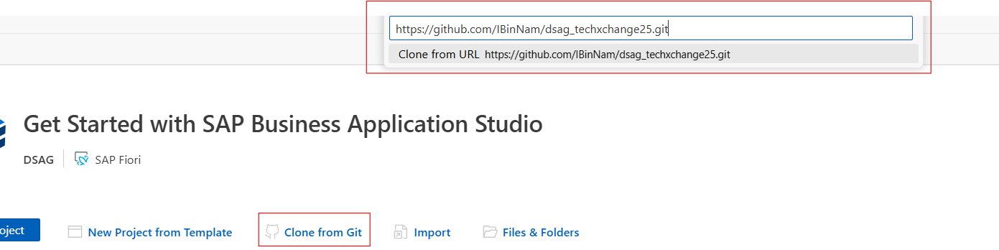
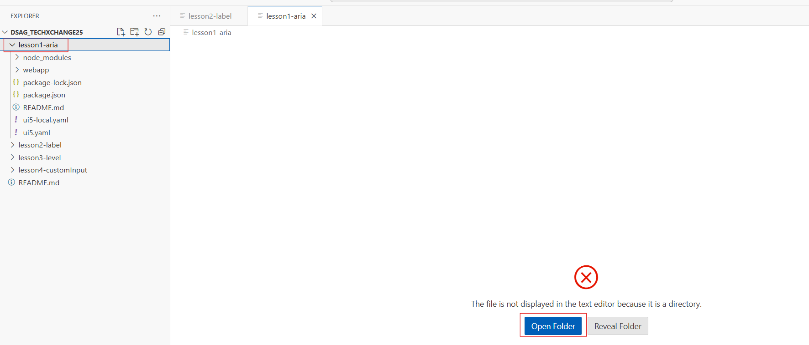
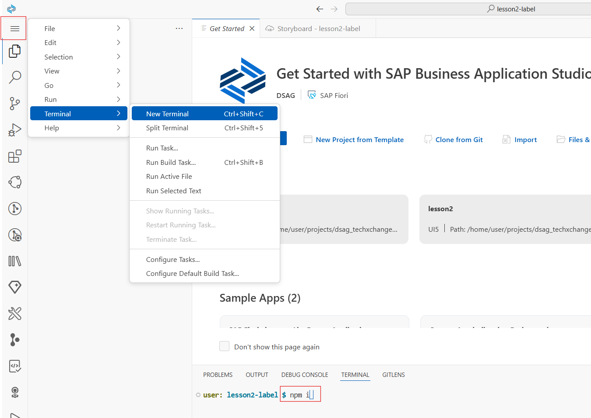

# Accessibility Hands-on Lessons

This repository contains hands-on lessons designed to teach and demonstrate best practices for building accessible web applications using SAP UI5. Each lesson focuses on a specific aspect of accessibility, providing practical examples and explanations.

## Purpose

The goal of these lessons is to help developers understand and implement accessibility features in their applications, ensuring inclusivity for all users, including those with disabilities.

## Prerequisites

- SAP BTP Trial account  
  Get a free account by following this tutorial: [Create a Free Account on SAP BTP Trial](https://developers.sap.com/tutorials/hcp-create-trial-account.html)

- Set Up SAP Business Application Studio for Development  
  Follow this tutorial to set up your development environment: [Set Up SAP Business Application Studio](https://developers.sap.com/tutorials/appstudio-onboarding.html)

## How to Clone a Git Repository in SAP Business Application Studio

To clone a Git repository in SAP Business Application Studio, follow these steps:

1. Open SAP Business Application Studio.
2. On the "Get Started" page, click the **Clone from Git** button.
3. A pop-up dialog will appear. Enter the URL of the Git repository you want to clone and click **Enter**.
4. The repository will be cloned into your workspace.

Below is an example of the GUI steps:




**Drag and Drop**: Drag the lesson folder from the file explorer on your computer and drop it into the workspace area of SAP Business Application Studio.

Below is an example of the GUI steps:



## Install Dependencies for Each Lesson

To install the required dependencies for each lesson, follow these steps:

1. Open the terminal in SAP Business Application Studio:
   - Click the **burger menu** (three horizontal lines) in the top-left corner.
   - Select **Terminal** > **New Terminal**.
2. Run the following command to install the dependencies:
   ```bash
   npm install
   ```
3. Wait for the installation to complete. Once done, you can start working on the lesson.

Below is an example of the GUI steps:



## Lessons Overview

- **[lesson1-aria](./lesson1-aria)**: Learn how to use ARIA roles, states, and properties to enhance accessibility for dynamic content.
- **[lesson2-label](./lesson2-label)**: Understand the importance of the `labelFor` property in SAPUI5 controls and how it improves form accessibility.
- **[lesson3-level](./lesson3-level)**: Understand the importance of semantic HTML and how to use `<Title>` and other elements to improve navigation and accessibility.
- **[lesson4-customInput](./lesson4-custom-input)**: Build a custom input control with enhanced accessibility features, such as `autocomplete="on"` and proper labeling for cognitive and motor-impaired users.